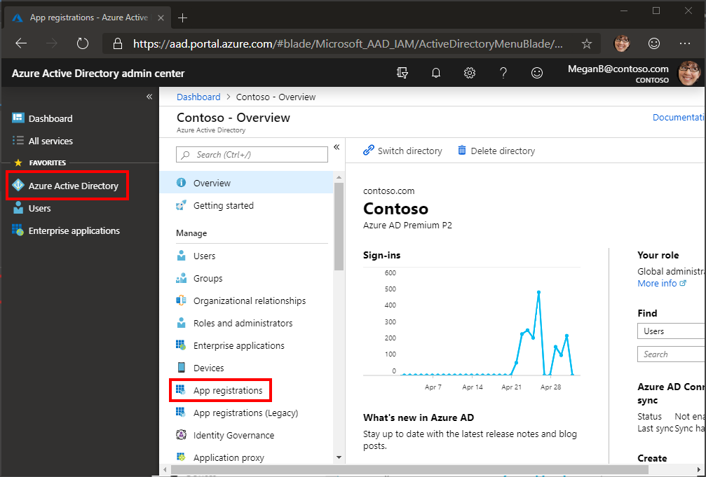

<!-- markdownlint-disable MD002 MD041 -->

En este ejercicio, creará una nueva aplicación de Azure AD con el centro de administración de Azure Active Directory.

1. Abra un explorador y vaya al [centro de administración de Azure Active Directory](https://aad.portal.azure.com) e inicie sesión con una **cuenta personal** (también conocida como: cuenta Microsoft) o una **cuenta profesional o educativa**.

1. Seleccione **Azure Active Directory** en el panel de navegación de la izquierda y, después, seleccione **registros de aplicaciones** en **administrar**.

    

1. Seleccione **Nuevo registro**. En la página **Registrar una aplicación**, establezca los valores siguientes.

    - Establezca **Nombre** como `Java Graph Tutorial`.
    - Establezca **Tipos de cuenta admitidos** en **Cuentas en cualquier directorio de organización y cuentas personales de Microsoft**.
    - En **URI de redireccionamiento**, cambie la lista desplegable a **cliente público (móvil & escritorio)** y establezca `https://login.microsoftonline.com/common/oauth2/nativeclient`el valor en.

    

1. Elija **Registrar**. En la página **tutorial de Java Graph** , copie el valor del **identificador de la aplicación (cliente)** y guárdelo, lo necesitará en el paso siguiente.

    

1. Seleccione **Autenticación** en **Administrar**. Busque la sección **Configuración avanzada** y cambie el valor de la opción **tratar la aplicación como un cliente público** a **sí**y, a continuación, elija **Guardar**.

    
